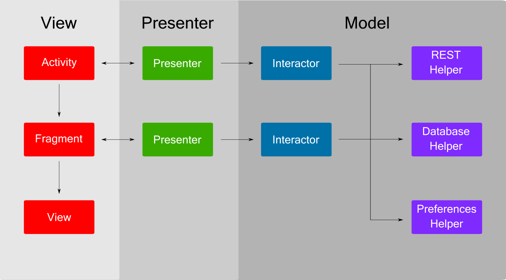

# Patrón MVP

Es un patrón derivado de MVC y es utilizado normalmente para lidiar con interfaces de usuario. Es la P (presentador) el que asume la función de intermediario/ mediador.



## Vista
La vista está muy limitada en este patrón, no hace nada pero muestra los datos y navega a otros pantallas cuando el presentador se lo comunica. **La vista no tiene visibilidad del modelo, excepto de la entidades/ POJO (Plain Old Java Object)**
En concreto cuando hablamos de la vista en Android, hablamos de Actividades, fragmentos, adaptadlres y cualquiera artefacto que que herede o implimente de la clase View. 

## Presentador
El presentador está situado entre la vista y el modelo, y este reacciona a los eventos pasados desde la vista. Por ejemplo, al hacer click en un botón llamado SaveButton en la vista, este llamará al método Save del presentador. 
```csharp
_presenter.Save();
```
Un vez que esto ocurre, el presentador utiliza el modelo (servicios) para validar tanto las reglas de negocio y como las validaciones. El presentador notificará a la vista para mostrar un mensaje de error o notificará a la vista para navegar a otra vista/ pantalla.

## Model

El modelo incluye lógica de negocio que está totalmente desacoplada de la UI, y abarca desde entidades, servicios (backend) y lógica de negocio. Se puede un wrapper (envoltorio) llamado Model o Interactor que se comunicará directamente con los servicios y que mantenga la lógica de negocio. 

# Implementación

*Para el ejemplo utilizaré la típica aplicación de lista de tareas (TODO list). Un listado de tareas, con un botón de crear y al hacer click sobre una tarea de la lista ver el detalle de la misma.*

La actividad/ fragmento implementará una interfaz que defina toda la funcionalidad que tendrá la vista.

### Referencias
* https://www.grapecity.com/en/blogs/applying-mvp-in-android/